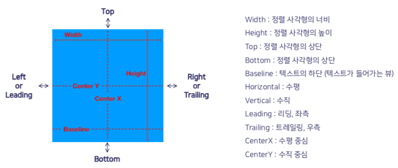
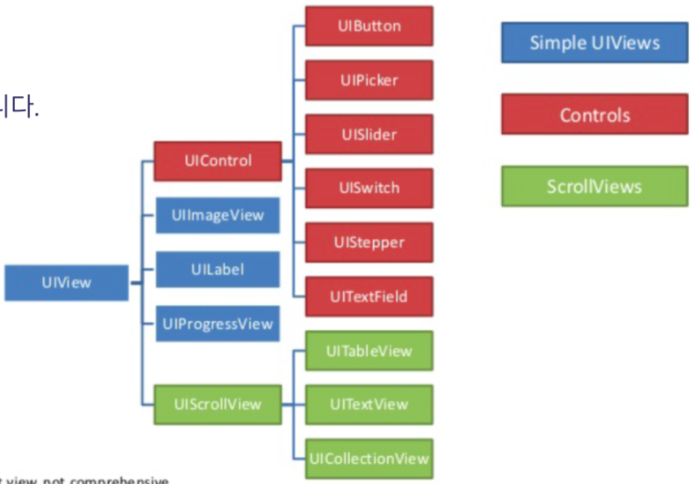
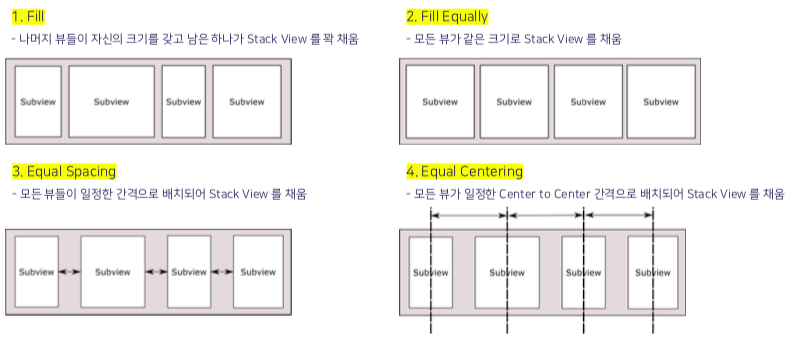
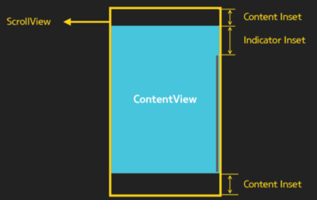

# 2차세미나

## 뷰 간 데이터 전달 및 화면 전환 보충

### 1.1 Textfield 값을 전달하기 - 전달하는 뷰에서

```swift
    @IBAction func pushButton(_ sender: Any) {
        
        guard let dvc = storyboard?.instantiateViewController(withIdentifier: "VC2") as? VC2
            else {return}
        
				// dvc.receivedData = myTextField.text
        
        // 위처럼 하고 끝내도 되는데 nil 값이 넘어갈 수 있으니 유효성 검사 실시
        let check = !(myTextField.text?.isEmpty ?? true)
        //text 값이 비어있으면 true 반환하게 됨
        //??는 optional 을 체크할 때 쓰느건데 nil 병합 연산자임. 
        //앞에값이 nil 일 경우에 물음표 뒤에 명시한 값이 반환됨. 가독성을 위해 앞에 !를 붙인거임

        if check {
            dvc.receivedData = myTextField.text
        }
        
        navigationController?.pushViewController(dvc, animated: true)
        //push : 오른쪽에서 왼쪽으로 넘어오는 애니메이션
        //present : 밑에서 위로
        
    }
```


### 1.2 Textfield 값을 전달하기 - 전달받는 뷰에서

```swift
var receivedData : String?

    @IBOutlet var receivedLabel: UILabel!
    
    override func viewDidLoad() {
        super.viewDidLoad()

        // Do any additional setup after loading the view.
        setup()
    }
    
    func setup(){
        if let transData = receivedData {
            receivedLabel.text = transData
        }
    }


////////////////////////////////////////////


    // present 로 새로운 ViewController 를 띄운 경우엔
    // dismiss 를 하여 이전 ViewController 로 돌아갑니다.
    @IBAction func dismissAction(_ sender: Any) {
        dismiss(animated: true)
    }
```


### 2.1 세그를 이용한 정적 화면전환 - 전환 전 뷰에서 with NavigationBar

```swift
    @IBAction func menualShowButton(_ sender: Any) {
        performSegue(withIdentifier: "menualShow", sender: self)
    }
    
    @IBAction func menualPresentButton(_ sender: Any) {
        performSegue(withIdentifier: "menualPresent", sender: self)
    }


// prepare 함수
   override func prepare(for segue: UIStoryboardSegue, sender: Any?) {
        
        if segue.identifier == "actionShow" { //action으로 연결해준 ActionSegue Show
            let sendData = myTextField.text
            
            let dvc = segue.destination as! VC2
            
            dvc.receivedData = sendData
        }
        
        switch segue.identifier {
        case "actionShow":
            let sendData = myTextField.text
            
        case "actionPresent":
            let sendData = myTextField.text
            let dvc = segue.destination as! VC2
            dvc.receivedData = sendData
            
        case "menualShow":
            let sendData = myTextField.text
            let dvc = segue.destination as! VC2
            dvc.receivedData = sendData
            
        case "manualPresent":
            let sendData = myTextField.text
            let dvc = segue.destination as! VC2
            dvc.receivedData = sendData
            
        default:
            break
        }
    }
    // 액션세그 : 터치나 클릭이일어났을때 세그발생 : 코드필요ㄴㄴ 눈에보이는 세그웨이객체 --> 직관성있는 뷰컨 트리구조 확인 가능한 장점.
    // 매뉴얼세그 : 퍼폼세그메소드를 이용해서 세그ㅡ를 코드로 직접 호출. 어떤 세그를 호출할지 코드로 직접 호출, 독의 맨처음버튼 누르고 컨트롤누르고 드래그하면 위에 메뉴얼세그라고 뜬다. identifier 정해줘야 함
    

```


### 2.2 세그를 이용한 정적 화면전환 - 전환 후 뷰에서 with NavigationBar

```swift
    /*
        NavigationController 에 pop 요청을 하여 이전 ViewController 로 돌아갑니다.
        NavigationController 는 배열로 구현되어 있습니다.
        따라서 이전 인덱스를 알고 있으니 별다른 대상을 지정해주지 않아도 되겠죠?
     */
    @IBAction func popAction(_ sender: Any) {
        navigationController?.popViewController(animated: true)
    }
```


### 2.3 unwind하기

```swift
//unwind 하기 전 뷰에다가

    // 스토리보드 상에서 생성한 Unwind Segue 를 수행합니다.
    // Unwind Segue 의 identifier 를 꼭 정의해주셔야 합니다.
    @IBAction func unwindAction(_ sender: Any) {
        performSegue(withIdentifier: "unwindToMain", sender: self)
    }

//unwind 할 뷰에다가 (돌아갈 뷰)

		//Unwind Segue 를 하기 위해서는 돌아고가자 하는 ViewController 에 아래와 같이 명시
    @IBAction func unwindToMain(_ sender : UIStoryboardSegue){
        //그냥 손으로 작성
    }
```


## Auto Layout

### 1. Auto Resizing

* 자동 크기 조절
* 비교적 단순한 인터페이스에서 유용하게 적용할 수 있는 레이아웃 제어 방식
* 직관적인 인터페이스를 통해 설정 가능
* 사용하기 아주 쉬움


* 그러나 잘 안 쓰기 때문에 이런게 있다는 정도만 알아두기! 실습 생략


### 2. Auto Layout

* 객체들 사이의 제약 조건을 차례대로 추가하는 방식으로 구성
* Auto Layout을 추가하기 전에 먼저 화면 상의 객체들이 가질 제약 조건을 먼저 정리해야 함


#### Safe Area Layout Guide

* UI 구현 시 iOS의 Status Bar 등과 겹치지 않도록 하기 위해 제공되는 일종의 기준선
* 겹치지 않게 화면을 구현하고 싶다면 가급적 지켜주어야 할 최소한의 영역


#### Safe Area

* iOS11 기준
  * 좌우 0 point, 상하 20 point의 간격으로 지정
  * 제약 조건 상에서 [Safe Area.top]으로 표시 = 상단 가장자리와의 20포인트 간격을 의미
  * Editor - Canvas - Show Layout Rectangles를 선택하면 Safe Area를 직접 볼 수 있음


#### 속성




## Stack View

### View?

* iOS에서 화면에 앱의 콘텐츠를 나타내기 위해 사용
  * Window와 View가 있는데 Window 쓸 일은 없으니까 View만 알아도 됨!
* View는 UIView 밑 하위 클래스의 인스턴스
  * View로 이미지, 문자, 도형 등 다양한 콘텐츠를 나타낼 수 있음
  * 제스처나 터치 이벤트를 감지하고 처리할 수 있음
  * View hierarchy 구조에서 부모 뷰와 자식 뷰의 위치 크기를 관리
  * 


### View hierarchy

* 하나의 View가 다른 View를 포함할 때, 두 View 사이에 부모-자식 관계가 생성됨
  * 부모 View = SuperView, 자식 View = SubView


### UIStackView

* View들을 **일정한 간격** 으로 Horizontal 혹은 Vertical로 배치하기 위해 사용
* Stack View 안에 들어가는 내용물은 일반적인 SubView가 아니라 **ArrangedSubView** 라고 함
* Constraint나 동적 할당 등으로 크기가 고정되어 있지 않으면 내용물로 Frame이 결정됨

#### Stack View 배치 방식 설정하기

* Alignment —> 무시해도 된다고 함
* **Distribution** : ArrangedSubView
  * 
* **Spacing** : ArrangedSubView 간의 일정한 간격


### 실습

#### Custom Button Class 사용해서 버튼을 동그라미 모양으로 만들기

* Class : CustomButton
  Subclass of : **UIButton**

```swift
import UIKit
class CustomButton: UIButton{
  required public init?(coder aDecoder: NSCoder){
    super.init(coder: aDecoder)
    
    layer.cornerRadius = frame.height/2
  }
}
```

* 버튼의 Custom Class를 CustomButton 으로 설정


#### Extensions

* 기존 클래스, 구조체 또는 열거형 타입에 새로운 기능들을 추가함
* 기존 소스 코드에서 접근하지 못하는 타입들을 확장함
  
* 가능한 기능들
  * 계산 속성과 계산 정적 속성 추가
  * 인스턴스 메소드와 타입 메소드 정의
  * 새로운 이니셜라이저 제공
  * 서브스크립트 정의
  * 새로운 중첩 타입 정의와 사용
  * 기존 타입에 프로토콜 적용하기


* 위처럼 CustomButton Class를 만들지 않고, 기존 ViewController Class 밖 아래에 

  ```swift
  extension UIButton{
    open override func awakeFromNib() {
      super.awakeFromNib()
      
      self.layer.cornerRadius = self.layer.frame.height/2
    }
  }
  ```

  이렇게 해도 됨 (해상도에 따라 버튼 크기 줄어들어서 동그라미—>마름모 되는거 조심)


### Scroll View

#### Frame과 Bounds

* Frame
  * Frame rectangle은 **SuperView의 좌표 시스템 안** 에서 View의 위치와 크기를 나타냄
* Bounds
  * Bounds rectangle은 **자기 자신의 좌표 시스템 안** 에서 View의 위치와 크기를 나타냄
  * **스크롤을 이동하면 Bounds 값이 변함**


#### UIScrollView

* 스크롤 기능을 구현하는 뷰
* UIScrollView는 거의 모든 아이폰 앱들의 Superclass가 되는 중요한 Class
* TableView나 CollectionView 모두 ScrollView의 Subclass임



* ContentView : 실제 ScrollView 내에서 보여지는 개체
* Content Inset : ContentView 내의 Padding 값을 설정
  * Navigationbar, Toolbar가 있는 경우 자동으로 bar의 크기에 맞게 Content Inset 값이 설정
* Indicator Inset
  * 우측 및 하단 스크롤 바의 Padding 값 설정


#### Content Inset

* 하위 뷰 컨텐츠의 상하좌우로 빈 공간(padding)을 주는 것

* **자기 자신의 바깥쪽이 아닌 안쪽으로 공간을 주어 하위 뷰를 둘러싸는 공간을 확장시키는 것**

* 공간확보를 원하는 뷰의 상위 뷰에다가 Content Inset을 줘야 함!

* ```swift
  myScrollView.contentInset = UIEdgeInset(top: 10, left: 10, bottom: 10, right: 10)
  ```


#### Content Offset

* Bounds의 Origin Point
* Bounds의 x, y좌표를 의미하는 것
* 스크롤을 한다는 것 자체가 Content Offset이 변하는 활동


* ```swift
  scrollView.contentOffset.x == scrollView.bounds.origin.x
  scrollView.contentOffset.y == scrollView.bounds.origin.y
  
  //Content Offset은 ScrollView의 Property로서 CGPoint 값을 대입해줄 수 있음
  myScrollView.contentOffset = CGPoint(x: 10.0, y: 10.0)
  ```


### 실습

* Inspector Area에서 View Controller의 Simulated Size 를 `fixed` —> `Freeform`으로 변경 후 Height 지정
* View Controller에 UIScrollView 추가, 상하좌우 0 constraints 지정
* 그 위에 UIView 추가, 상하좌우 0 constraints 지정
* 추가한 UIView를 최상위 View에 `Equal Widths` & `Equal Heights`
  * `Equal Heights`constraint는 Priority 를 Low(250)으로


* 그 후에 원하는 컨텐츠들 추가하면 됨


끝