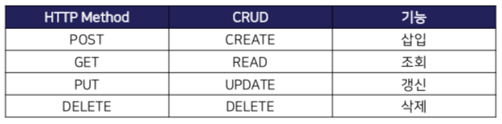
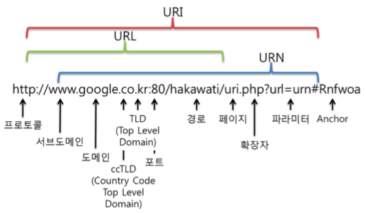
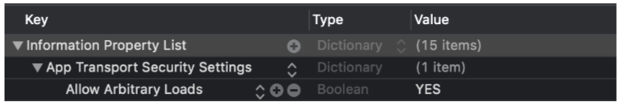

# 4차세미나 : Network

함수 관련 문법 보충 세미나는 [여기](<https://github.com/iamcho2/SOPT-24th/blob/master/week4/function.md>) 

실습은 [여기]()

## Client

* 어플리케이션의 적절한 작동을 위해 서버에 데이터 처리를 요청하는 객체
* 스마트폰, 노트북, 데스크탑 등 인터넷을 사용하는 모든 것들이 클라이언트
* 사용자들이 서비스를 이용하기 위해 필요한 정보를 서버에 요청하고, 받아와서 가공함

## Server

* 클라이언트에게 네트워크를 통해 정보나 서비스를 제공하는 컴퓨터 또는 프로그램
* 클라이언트가 요청을 하면 데이터를 처리하여 결과를 다시 클라이언트에게 보내준다

## Protocol

* 요청과 응답을 주고 받기 위해 정해진 약속
* 통신을 원하는 두 객체 간에 무엇을, 어떻게 통신할 것인지 서로 약속한 규약

## 네트워크 통신의 종류

1. TCP/UDP 를 사용하는 소켓 방식의 연결성 통신
   * 보통 저수준(Low-level) 통신을 통해 구현됨
   * 일단 앱-서버가 연결되면 한쪽에서 명시적으로 연결을 끊을 때 까지 연결 유지
   * 연결, 연결 유지, 연결 종료 단계 등으로 상태 구분 가능
     * 각 단계에 따라 적절히 대응하는 방식으로 프로그래밍
   * 빠르게 메시지를 주고 받을 수 있는 장점
   * 연결을 유지하기 위해 많은 네트워크 대역 소모, 큰 서버 부하의 단점
   * 두 가지
     * TCP 연결
       * 데이터 유실 방지, 완전한 전송 보장
       * 상대적으로 덜 빠름
     * UDP 연결
       * 데이터의 완전한 전송 보장 X
       * 상대적으로 더 빠름
         
2. HTTP, HTTPS, SMTP 등의 프로토콜을 이용한 비연결성 통신
   * 웹 서비스에서 주로 사용
   * 요청이 들어오면 이에 맞는 응답을 보낸 후 바로 연결을 종료
   * 매 요청마다 연결해야 함
     * 소켓 방식에 비해 속도에 제약이 있음
     * 불필요한 대역 소모 줄임, 서버 부하 낮출 수 있음
     * 범용적인 모바일 서비스에서 많이 사용
       
   * 동일한 HTTP/HTTPS 프로토콜을 사용하지만
     * 일반 HTML을 제공하는 건 웹 페이지
     * 데이터만을 주고 받을 수 있도록 설계된 모듈은 웹 서비스
       * 우리가 할 것
         
   * 웹 서비스
     * 아키텍쳐 구조에 따라 SOAP / **RESTful** 방식 
     * 데이터 타입에 따라 XML / JSON 방식

### HTTP 프로토콜

* **GET**
  * URI( or URL)에 변수를 포함시켜 서버에 데이터를 요청하는 방식
  * 리소스를 읽을 때 주로 사용
    
* **PUT**
  * 해당 리소스에 대한 데이터의 수정(업데이트)에 주로 사용
    
* **POST**
  * 데이터를 Request Body에 숨겨 서버에 전달하는 방식
  * 데이터의 전송, 삽입 및 갱신에 주로 사용
    
* **DELETE**
  * 해당 리소스에 대한 데이터의 삭제에 주로 사용

### URI와 URL

* URI (Uniform Resource Identifier)
  * 인터넷에 있는 자원을 나타내는 유일한 주소
  * 특정 리소스를 가리키는 의미있는 식별자 (주소, 키 등)
    
* URL (Uniform Resource Locator)
  * 특정 리소스를 가리키는 경로
  * 자원이 어디 있는지 알려주기 위한 규약
  * URL은 URI의 부분 집합
    

### RESTful 방식

* REST : Representational State Transfer

  * 분산 하이퍼 미디어 시스템을 위한 소프트웨어 아키텍처의 한 형식
  * 엄밀히 말하면 네트워크 프로토콜은 아니고, 네트워크 자원을 정의하고 자원에 대한 주소를 관리하는 방법
  * 웹 형식을 빌어 데이터를 전송하되, SOAP나 쿠키 등 별도의 전송 프로토콜 없이 전송하기 위해 만들어진 간단한 형식의 인터페이스
    

* REST는 HTTP 프로토콜을 바탕으로 필요한 데이터를 별도의 규약 없이 주고받기만 하면 됨

  * 특정 웹 페이지를 보기 위해 웹 브라우저에 URL을 입력하는 것처럼

    데이터를 요청하는 URI를 네트워크를 통해 서버에 전달하면 서버에서는 그에 맞는 응답 데이터가 전송됨

## REST API

Representational State Transfered API

* 행위, 자원, 메시지로 구성
  * 행위(Verb) : HTTP Method
  * 자원(Resource) : URI
  * 메시지(Representation) : {name: "정초이"} 와 같은 JSON 포맷의 데이터
    
* 유일한 오브젝트에 대해 직관적인 URI로 접근
* 전달 방식으로 HTTP Method를 사용하여 조회/삽입/갱신/삭제 수행

### REST API 중심 규칙

1. URI는 정보의 자원을 표현해야 한다
2. 자원에 대한 행위는 HTTP Method로 표현한다

### JSON

* Javascript Object Notation 의 약자
* xml 보다 가벼운 데이터 교환 포맷
* 주고 받을 수 있는 자료형은 Int, String, Boolean, Array, Object
* Key와 Value로 이루어져 있으며 객체는 중괄호 {}, 배열은 대괄호 []로 감싼다.

## iOS에서  HTTP 통신 허용하기

info.plist 파일에 항목 추가하기

## Cocoapods

